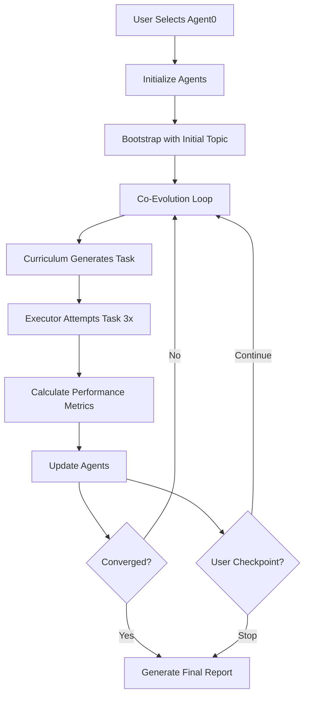

# Agent0 Integration into InfiniteResearch System

## Overview

The Agent0 self-evolving research system has been successfully integrated into your InfiniteResearch project, based on the paper "Agent0: Unleashing Self-Evolving Agents from Zero Data via Tool-Integrated Reasoning".

## What's New

### Menu Option Added
- **[A] Start Agent0 Self-Evolving Research** - New option in the main menu
- Appears alongside existing options for standard research and BMAD multi-agent research

### Files Created/Modified

1. **`agents/agent0_orchestrator.py`** (NEW)
   - Complete implementation of Agent0 framework
   - `CurriculumAgent`: Generates progressively harder research tasks
   - `ExecutorAgent`: Learns to complete tasks with improving capability
   - `Agent0ResearchSession`: Manages the co-evolutionary loop

2. **`utils/research_selector.py`** (MODIFIED)
   - Added Agent0 option to menu display
   - Added handler for 'agent0' action selection

3. **`research_orchestrator.py`** (MODIFIED)
   - Imported Agent0 module
   - Added `run_agent0()` method
   - Added `_compile_agent0_report()` for report generation
   - Integrated Agent0 action handler in main loop

4. **`test_agent0.py`** (NEW)
   - Test script demonstrating Agent0 integration
   - Feature description and workflow explanation

## Key Features from the Paper

### 1. Co-Evolutionary Architecture
```
Curriculum Agent ←→ Executor Agent
     ↓                    ↓
Generates Tasks      Completes Tasks
     ↓                    ↓
  Increases           Improves
  Complexity         Capability
```

### 2. Reward Functions
- **Uncertainty Reward (Runc)**: Targets ~50% executor uncertainty
- **Tool Use Reward (Rtool)**: Encourages tool integration
- **Repetition Penalty (Rrep)**: Promotes task diversity
- **Composite**: `Rc = Runc + Rtool - Rrep`

### 3. Self-Improvement Mechanics
- No human data required
- Agents bootstrap from simple tasks
- Progressive complexity increase
- Automatic convergence detection

## How to Use

### Starting an Agent0 Session

1. **Run the orchestrator:**
   ```bash
   python research_orchestrator.py
   ```

2. **Select Agent0 option:**
   ```
   Select an option:

   [0] Start NEW research (standard web search)
   [A] Start Agent0 Self-Evolving Research    ← SELECT THIS
   [B] Start BMAD Multi-Agent Research
   ```

3. **Provide initial topic:**
   ```
   Enter initial research topic for Agent0 co-evolution: [your topic]
   ```

4. **Monitor co-evolution:**
   - Watch as tasks become progressively complex
   - Observe executor confidence improvements
   - Interactive checkpoints every 3 iterations

### Configuration Options

Add to your `config.yaml`:

```yaml
agent0:
  max_iterations: 10  # Maximum co-evolution iterations
  model: gpt-4       # Model to use for agents
  checkpoint_frequency: 3  # User checkpoint every N iterations
```

## Agent0 Workflow



## Output Structure

Agent0 creates the following outputs:

```
research_sessions/
└── research_YYYYMMDD_HHMMSS/
    ├── agent0_session.db         # Agent conversation history
    ├── agent0_final_report.json  # Detailed JSON report
    └── agent0_report.md          # Human-readable markdown report
```

## Example Report Contents

### Evolution Trajectory
| Iteration | Task Complexity | Executor Confidence | Curriculum Reward |
|-----------|----------------|--------------------|--------------------|
| 1         | 0.30           | 0.45               | 0.62              |
| 2         | 0.42           | 0.52               | 0.71              |
| 3         | 0.55           | 0.61               | 0.68              |
| ...       | ...            | ...                | ...               |

### Key Insights
- Task complexity evolved from 0.30 to 0.75
- Executor confidence improved from 0.45 to 0.72
- Average tool usage: 3.2 calls per task

## Advantages Over Standard Research

| Feature | Standard Research | Agent0 Research |
|---------|------------------|-----------------|
| Task Generation | Static queries | Adaptive complexity |
| Agent Improvement | None | Continuous learning |
| Quality Control | Single attempt | Multi-attempt consistency |
| Complexity | Fixed | Progressive increase |
| Convergence | Manual stop | Automatic detection |

## Integration with Existing Features

Agent0 works seamlessly with your existing:
- **Vector Store**: Stores all research findings
- **File Manager**: Organizes outputs by session
- **Logger**: Beautiful console output with progress tracking
- **Refinement Engine**: Can be used for post-processing

## Testing

Run the test script to verify integration:

```bash
python test_agent0.py
```

This will:
1. Display Agent0 features
2. Show the updated menu
3. Confirm integration success

## Future Enhancements

Consider adding:
1. **Multi-agent teams**: Multiple executor agents competing
2. **Domain specialization**: Curriculum agents for specific fields
3. **Transfer learning**: Reuse learned capabilities across sessions
4. **Visualization**: Real-time evolution graphs
5. **Custom tools**: Integrate domain-specific tools for executors

## References

Based on: "Agent0: Unleashing Self-Evolving Agents from Zero Data via Tool-Integrated Reasoning"
- Authors: Peng Xia et al.
- Key concepts: Co-evolution, tool integration, self-improvement without human data
- Innovation: Breaking dependency on human-curated datasets through autonomous agent evolution

---

*Integration completed successfully. The Agent0 system is ready for use in your InfiniteResearch project.*